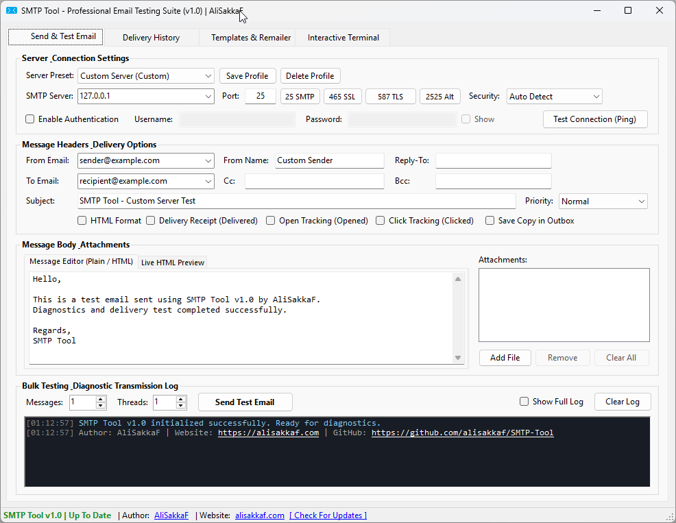
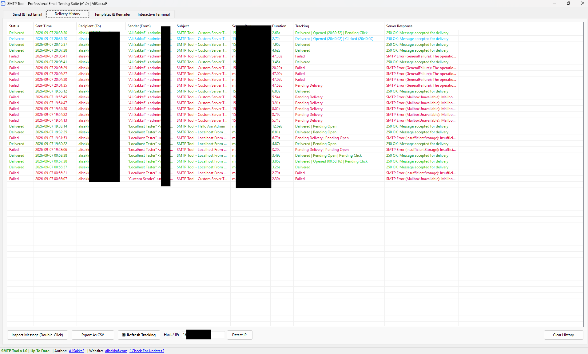
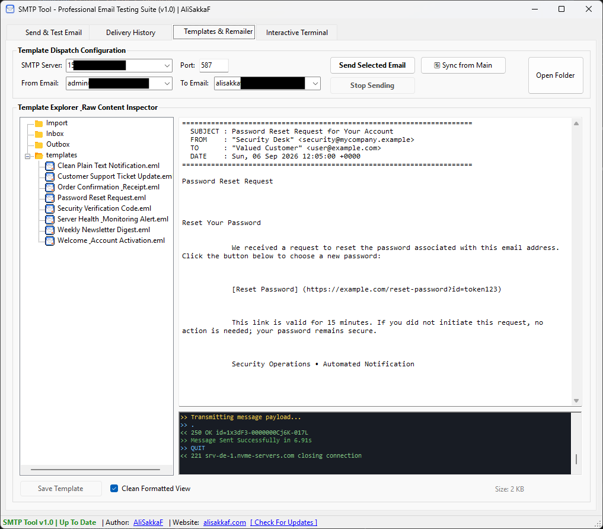
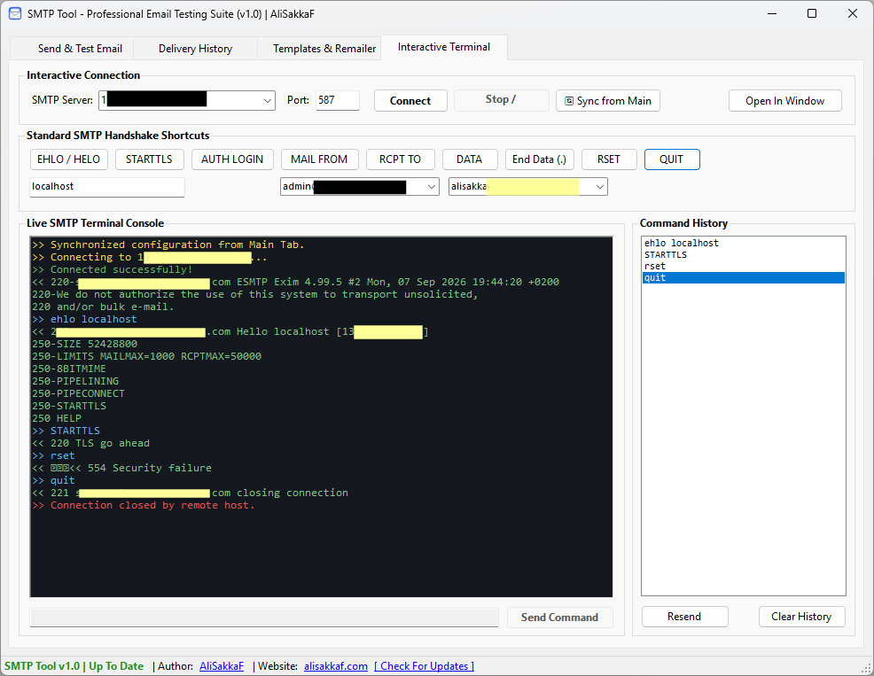

<p align="center">
  
</p>

<h1 align="center">SMTP Tool</h1>

<p align="center">
  <strong>High-Performance SMTP Testing, Server Diagnostics & Email Debugging Suite for Windows</strong>
</p>

<p align="center">
  <a href="https://github.com/alisakkaf/SMTP-Tool/releases"></a>
  <a href="https://github.com/alisakkaf/SMTP-Tool/releases"></a>
  <a href="LICENSE"></a>
  <a href="https://dotnet.microsoft.com/download/dotnet-framework/net48"></a>
  <a href="https://alisakkaf.com"></a>
</p>

---

## Overview

**SMTP Tool** is an advanced, lightweight, and high-performance Windows desktop application engineered for developers, DevOps engineers, and system administrators to test, diagnose, benchmark, and debug SMTP mail servers with confidence.

Whether verifying outbound mail connectivity on local development environments, authenticating against enterprise mail gateways (Microsoft 365, Google Workspace, Amazon SES), inspecting raw MIME structures and base64 payloads, or simulating bulk load delivery, **SMTP Tool** delivers a comprehensive, developer-first diagnostic suite.

---

## Screenshots & Interface Walkthrough

<p align="center">
  
</p>

<details open>
<summary><strong>📸 Additional Views & Diagnostic Tabs (Click to expand / collapse)</strong></summary>
<br>

### 1. Delivery History & Engagement Tracking
<p align="center">
  
</p>

### 2. Clean Template Explorer & EML Remailer
<p align="center">
  
</p>

### 3. Interactive Telnet SMTP Terminal & Protocol Console
<p align="center">
  
</p>

</details>

---

## Features

| Feature | Description |
| ------- | ----------- |
| **Modern Security & TLS** | Native support for TLS 1.2 and TLS 1.3 protocols with automatic security negotiation, implicit SSL/TLS (Port 465), and explicit STARTTLS (Port 587). |
| **Full Authentication** | Complete credentials support (`AUTH LOGIN`, `PLAIN`) with secure password masking and real-time visibility toggle. |
| **Server Profile Manager** | Save, load, and manage reusable server profiles with built-in presets for **Custom Server (Custom)**, **Gmail**, **Office 365**, **Amazon SES**, **Yahoo Mail**, and **Localhost**. |
| **Persistent Delivery History** | Delivery history is preserved in `delivery_history.xml` beside the application. View sent timestamps, recipient addresses, duration benchmarks, and status responses across application restarts. |
| **Delivery & Engagement Tracking** | Built-in simulation options for: <br>&bull; **Delivered**: RFC delivery receipts (`Disposition-Notification-To`, `Return-Receipt-To`, and DSN options).<br>&bull; **Opened**: 1x1 transparent open-tracking pixel simulation.<br>&bull; **Clicked**: Tracked redirect click simulation. |
| **Detailed Protocol Log & "Show Full Log" Toggle** | Real-time transmission log with a `Show Full Log` toggle to view complete step-by-step socket, DNS, EHLO, envelope, and response transcripts. |
| **Clean Template Explorer** | Clean, formatted view for `.eml` templates in the `mailbox/` directory. Strips raw HTML and MIME delimiters for readability while preserving RFC-compliant raw streams for transmission. |
| **Interactive SMTP Terminal** | Telnet-style command terminal with one-click RFC 5321 shortcuts (`EHLO`, `STARTTLS`, `AUTH`, `MAIL FROM`, `RCPT TO`, `DATA`, `QUIT`). |
| **Dual-Pane HTML & Plain Text Editor** | Live dual-pane editor featuring real-time HTML email preview alongside plain-text source inspection and multi-file attachment management. |
| **Automated Update Checker** | Non-blocking background updater checks GitHub Releases on startup (`vX.X` format) to notify users of new releases. |
| **Universal Windows Compatibility** | Runs seamlessly across Windows 7 SP1, Windows 8, Windows 8.1, Windows 10, and Windows 11 without third-party runtime bloat. |

---

## Quick Port Reference

| Port | Protocol | Encryption Method | Typical Use Case |
| ---- | -------- | ----------------- | ---------------- |
| **25** | SMTP | None / Optional STARTTLS | Server-to-server mail relays & local MTAs |
| **465** | SMTPS | Implicit SSL / TLS | Secure client submission (Legacy/Direct SSL) |
| **587** | SMTP | Explicit STARTTLS (Recommended) | Modern secure client-to-server mail submission |
| **2525** | SMTP | STARTTLS / None | Cloud alternative port (bypasses ISP Port 25 blocking) |

---

## Delivery Tracking & Engagement Simulation

SMTP Tool provides testing toggles to simulate delivery receipts and user engagement before launching email campaigns:

- **Delivery Receipt (Delivered)**: Injects `Disposition-Notification-To` and `Return-Receipt-To` headers and enables RFC DSN flags (`OnSuccess`, `OnFailure`) to request delivery verification from supporting MTAs.
- **Open Tracking (Opened)**: Automatically injects a lightweight `1x1` transparent tracking pixel (`GIF`) with a unique identifier into HTML messages to simulate open-rate monitoring.
- **Click Tracking (Clicked)**: Injects an identifiable click-tracking redirect URL into HTML and plain-text message bodies to test click-through monitoring handlers.

---

## Step-by-Step Diagnostic Handshake

When transmitting an email, **SMTP Tool** measures and reports each phase of the network lifecycle with millisecond precision:

```text
[STEP 1] DNS Resolution: Resolves remote host IP address and measures latency.
[STEP 2] TCP Handshake: Validates socket connectivity and measures connection delay.
[STEP 3] TLS / SSL Negotiation: Secures channel using TLS 1.2 or TLS 1.3 cryptography.
[STEP 4] EHLO / HELO Greeting: Exchanges server capabilities (8BITMIME, SIZE, AUTH).
[STEP 5] Authentication: Transmits credentials securely via SASL authentication.
[STEP 6] Envelope Addressing: Sends MAIL FROM and validates recipient via RCPT TO.
[STEP 7] DATA Transfer: Transmits message body, HTML payload, and MIME attachments.
[STEP 8] Server Response: Captures server acknowledgment (e.g. 250 OK Queue ID).
```

Check the **Show Full Log** checkbox in the log panel to inspect every raw line sent and received.

---

## Included Transactional Templates

The `mailbox/templates/` folder provides clean, production-grade email samples:

1. **`Welcome & Account Activation.eml`** - Clean user onboarding verification email.
2. **`Password Reset Request.eml`** - Security notification with expiring reset token button.
3. **`Order Confirmation & Receipt.eml`** - Itemized transaction invoice and receipt.
4. **`Security Verification Code.eml`** - Two-factor authentication (2FA) numeric code sample.
5. **`Server Health & Monitoring Alert.eml`** - Infrastructure threshold alert notice.
6. **`Weekly Newsletter Digest.eml`** - Curated multi-story newsletter layout.
7. **`Customer Support Ticket Update.eml`** - Helpdesk ticket resolution update.
8. **`Clean Plain Text Notification.eml`** - Minimal RFC-compliant plain text system message.

Templates opened in the **Remailer & Templates** tab are automatically formatted into readable headers and body text. Toggle **Clean Formatted View** off at any time to inspect or edit the raw MIME code.

---

## Installation & Build

### Option 1: Standalone Portable Executable (Recommended)

1. Download the latest release (`SMTPTool.exe`) from the [**Releases Page**](https://github.com/alisakkaf/SMTP-Tool/releases).
2. Extract or place `SMTPTool.exe` in your desired directory.
3. Run `SMTPTool.exe` directly — no installation required.

### Option 2: Build From Source

```bash
# 1. Clone repository
git clone https://github.com/alisakkaf/SMTP-Tool.git
cd SMTP-Tool

# 2. Build via MSBuild or Visual Studio 2022
msbuild source/SMTPtool.sln /p:Configuration=Release

# 3. Launch compiled binary
./source/SMTPtool/bin/Release/SMTPTool.exe
```

---

## Contributing & Support

Contributions, feature requests, and bug reports are welcome.

- **Found a bug or have a suggestion?** Open an issue on **[GitHub Issues](https://github.com/alisakkaf/SMTP-Tool/issues)**.
- **Want to contribute code?** Submit a **[Pull Request](https://github.com/alisakkaf/SMTP-Tool/pulls)** following the guidelines in [CONTRIBUTING.md](CONTRIBUTING.md).
- **Security Inquiries**: Report security concerns directly via GitHub Issues or Pull Requests as detailed in [SECURITY.md](SECURITY.md). All public communication is handled through GitHub.

---

## Author & Maintainer

<p align="center">
  <strong>Ali Sakkaf (AliSakkaF)</strong><br>
  <em>Senior Software Engineer & Solution Architect</em>
</p>

<p align="center">
  <a href="https://alisakkaf.com"></a>
  <a href="https://github.com/alisakkaf"></a>
  <a href="https://www.facebook.com/AliSakkaf.Dev"></a>
</p>

---

## License

This project is licensed under the **MIT License** — see the [LICENSE](LICENSE) file for details.  
Copyright &copy; 2026 **Ali Sakkaf**. All rights reserved.