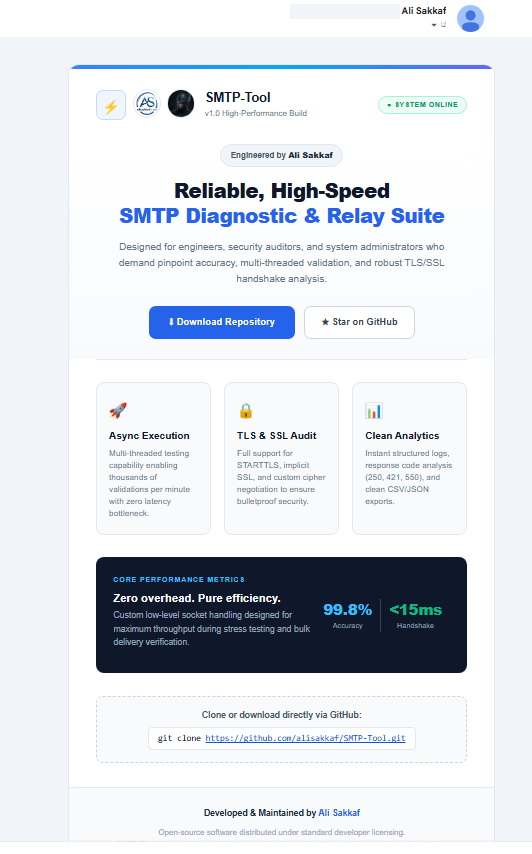

<p align="center">
  
</p>

<h1 align="center">SMTP Tool</h1>

<p align="center">
  <strong>High-Performance SMTP Testing, Server Diagnostics & Email Debugging Suite for Windows</strong>
</p>

<p align="center">
  <a href="https://github.com/alisakkaf/SMTP-Tool/releases"></a>
  <a href="https://github.com/alisakkaf/SMTP-Tool/releases"></a>
  <a href="https://github.com/alisakkaf/SMTP-Tool/stargazers"></a>
  <a href="https://github.com/alisakkaf/SMTP-Tool/network/members"></a>
  <a href="LICENSE"></a>
  <a href="https://dotnet.microsoft.com/download/dotnet-framework/net48"></a>
  <a href="https://alisakkaf.com"></a>
</p>

<p align="center">
  <a href="#-supported-windows-operating-systems"></a>
  <a href="https://github.com/alisakkaf/SMTP-Tool/releases/latest/download/SMTPTool-v1.0-Windows.zip"></a>
</p>

---

## ⚡ Quick Start (1-Minute Setup)

Download and launch the standalone portable application with zero installation required:

### Option A: Direct Download
👉 **[Download Latest Release (SMTPTool-v1.0-Windows.zip)](https://github.com/alisakkaf/SMTP-Tool/releases/latest/download/SMTPTool-v1.0-Windows.zip)** — Extract and run `SMTPTool.exe` directly!

### Option B: PowerShell 1-Click Launch
Paste this command into **PowerShell** to download and run automatically:
```powershell
Invoke-WebRequest -Uri "https://github.com/alisakkaf/SMTP-Tool/releases/latest/download/SMTPTool-v1.0-Windows.zip" -OutFile "$env:TEMP\SMTPTool.zip"
Expand-Archive -Path "$env:TEMP\SMTPTool.zip" -DestinationPath "$env:TEMP\SMTPTool" -Force
Start-Process "$env:TEMP\SMTPTool\SMTPTool.exe"
```

---

## 📖 Overview

**SMTP Tool** is an advanced, lightweight, and high-performance Windows desktop application engineered for developers, DevOps engineers, and system administrators to test, diagnose, benchmark, and debug SMTP mail servers with confidence.

Whether verifying outbound mail connectivity on local development environments, authenticating against enterprise mail gateways (Microsoft 365, Google Workspace, Amazon SES), inspecting raw MIME structures and base64 payloads, or simulating bulk load delivery, **SMTP Tool** delivers a comprehensive, developer-first diagnostic suite.

---

## 📸 Screenshots & Interface Walkthrough

<p align="center">
  
</p>

<details open>
<summary><strong>📸 Additional Diagnostic Views & Tabs (Click to expand / collapse)</strong></summary>
<br>

### 1. Delivery History & Live Engagement Tracking
<p align="center">
  
</p>

### 2. Clean Template Explorer & EML Remailer
<p align="center">
  
</p>

### 3. Interactive Telnet SMTP Terminal & Protocol Console
<p align="center">
  
</p>

### 4. Rendered HTML Email Preview in Gmail Inbox Delivered by SMTP Tool
<p align="center">
  
</p>


</details>

---

## 🌟 Why SMTP Tool? (Key Differentiators)

What sets **SMTP Tool** apart from generic SMTP testers:

| Capability | Generic SMTP Testers | SMTP Tool by AliSakkaF |
| ---------- | :-------------------: | :--------------------: |
| **Real-Time Open & Click Tracking** | ❌ None | ✅ **Built-in Local HTTP Tracking Server (Port 8085/8088)** |
| **Stop Sending Cancel Button** | ❌ Must wait for timeout | ✅ **Instant Cancel with 1-Click `Stop Sending`** |
| **Step-by-Step Latency Benchmark** | ❌ Only tells if pass/fail | ✅ **Millisecond DNS, TCP, TLS, and DATA Metrics** |
| **Delivery History Persistence** | ❌ Cleared on exit | ✅ **Saved in `delivery_history.xml` across sessions** |
| **Clean EML & Template Formatting** | ❌ Raw unreadable MIME | ✅ **Clean Formatted Preview + Raw MIME Toggle** |
| **TLS 1.2 / 1.3 & Lab SSL Bypass** | ⚠️ Often buggy or unsupported | ✅ **Native TLS 1.3 / STARTTLS with Self-Signed Bypass** |
| **Interactive Protocol Terminal** | ❌ Not included | ✅ **Telnet Terminal with RFC 5321 Shortcuts** |
| **Portability & Footprint** | ⚠️ Heavy installers / Electron bloat | ✅ **Zero-Dependency Native Portable Win32 Executable** |

---

## 🪟 Supported Windows Operating Systems

SMTP Tool is built for universal backward and forward compatibility across Microsoft Windows:

| Windows Version | Architecture | Compatibility Status | Notes |
| :-------------- | :----------: | :------------------: | :---- |
| **Windows 11** (All builds up to Version 26H1, OS Build 28020.2731) | x64 / ARM64 | 🟢 **Fully Supported** | Native look, high-DPI scaling verified, latest insider/canary tested |
| **Windows 10** (All Editions) | x86 / x64 | 🟢 **Fully Supported** | Standard enterprise benchmark |
| **Windows 8.1 / 8** | x86 / x64 | 🟢 **Fully Supported** | Tested & verified |
| **Windows 7 SP1** | x86 / x64 | 🟢 **Fully Supported** | Requires .NET Framework 4.8 runtime |
| **Windows Server** (2012 – 2025) | x64 | 🟢 **Fully Supported** | Ideal for server-side MTA verification |

---

## ✨ Comprehensive Feature Matrix

### 🔐 Security & Transport Protocols
- **TLS 1.2 and TLS 1.3**: Automatic cryptographic negotiation for modern cloud mail services.
- **Port 587 (Explicit STARTTLS)**: Standard client-to-server submission with channel upgrading.
- **Port 465 (Implicit SSL/TLS)**: Direct encrypted connection via SMTPS.
- **Port 25 & 2525 (Plain / Relay)**: Standard unencrypted MTA relays and alternative cloud ports.
- **Custom Certificate Validation Bypass**: Test self-signed lab certificates without Windows trust errors.

### 👤 Authentication & Profiles
- **Authentication Methods**: Full `AUTH LOGIN` and `AUTH PLAIN` support.
- **Password Security**: Masked password input with instant show/hide toggle.
- **Pre-configured Profiles**: One-click configuration for **Custom Server (Custom)**, **Gmail**, **Microsoft 365**, **Amazon SES**, **Yahoo Mail**, and **Localhost (127.0.0.1)**.

### 📊 Real-Time Diagnostic Handshake
Every test transmission is instrumented and logged with millisecond precision:
```text
[STEP 1] DNS Resolution: Resolves remote host IP address and measures latency (e.g. 14 ms).
[STEP 2] TCP Handshake: Validates socket connectivity and measures connection delay (e.g. 28 ms).
[STEP 3] TLS / SSL Negotiation: Secures channel using TLS 1.2 or TLS 1.3 cryptography.
[STEP 4] EHLO / HELO Greeting: Exchanges server capabilities (8BITMIME, SIZE, AUTH).
[STEP 5] Authentication: Transmits credentials securely via SASL authentication.
[STEP 6] Envelope Addressing: Sends MAIL FROM and validates recipient via RCPT TO.
[STEP 7] DATA Transfer: Transmits message body, HTML payload, and MIME attachments.
[STEP 8] Server Response: Captures server acknowledgment (e.g. 250 2.0.0 OK Queue ID).
```

### 🛰️ Live Tracking Server & Engagement Simulation
- **Delivery Receipt (Delivered)**: Injects `Disposition-Notification-To` and `Return-Receipt-To` headers and RFC DSN flags (`OnSuccess`, `OnFailure`).
- **Open Tracking (Opened)**: Automatically injects a lightweight `1x1` transparent tracking pixel GIF with a unique identifier.
- **Click Tracking (Clicked)**: Injects a tracked redirect link into HTML and plain text bodies.
- **Real-Time UI Update**: The delivery history listview dynamically reacts and switches status to `🟢 Opened (HH:mm:ss)` and `🔵 Clicked (HH:mm:ss)` upon receiving HTTP requests.
- **Interactive Simulation**: Right-click any history row to simulate open/click triggers or test tracking endpoints directly in your browser.

### 🛑 Emergency Stop Sending Control
- Click the **Stop Sending** button at any time during active or bulk transmissions to immediately abort remaining messages and close active sockets without waiting for 20-second timeout errors.

### 📨 Clean EML Template Explorer
Included non-spam production transactional templates in `templates/`:
1. **`Welcome & Account Activation.eml`** — Clean user onboarding verification email.
2. **`Password Reset Request.eml`** — Security notice with expiring reset token button.
3. **`Order Confirmation & Receipt.eml`** — Itemized transaction invoice and receipt.
4. **`Security Verification Code.eml`** — Two-factor authentication (2FA) numeric code sample.
5. **`Server Health & Monitoring Alert.eml`** — Infrastructure threshold alert notice.
6. **`Weekly Newsletter Digest.eml`** — Curated multi-story newsletter layout.
7. **`Customer Support Ticket Update.eml`** — Helpdesk ticket resolution update.
8. **`Clean Plain Text Notification.eml`** — Minimal RFC-compliant plain text system message.

---

## 🛠️ Build From Source

To build **SMTP Tool** from source using Visual Studio or MSBuild:

```bash
# 1. Clone repository
git clone https://github.com/alisakkaf/SMTP-Tool.git
cd SMTP-Tool

# 2. Build via MSBuild (Release mode)
msbuild source/SMTPtool.sln /p:Configuration=Release

# 3. Launch compiled executable
./source/SMTPtool/bin/Release/SMTPTool.exe
```

---

## 🤝 Contributing & Community Support

Contributions, issue reports, and feature suggestions are highly appreciated!

- **Found a bug?** Submit an issue on **[GitHub Issues](https://github.com/alisakkaf/SMTP-Tool/issues)**.
- **Have an idea?** Start a discussion or open a **[Feature Request](https://github.com/alisakkaf/SMTP-Tool/issues/new?template=feature_request.md)**.
- **Want to contribute?** Submit a **[Pull Request](https://github.com/alisakkaf/SMTP-Tool/pulls)** following our [CONTRIBUTING.md](CONTRIBUTING.md) guidelines.
- **Security Reports**: Review our [SECURITY.md](SECURITY.md) policy.

---

## 👨‍💻 Author & Maintainer

<p align="center">
  <strong>Ali Sakkaf (AliSakkaF)</strong><br>
  <em>Senior Software Engineer & Solution Architect</em>
</p>

<p align="center">
  <a href="https://alisakkaf.com"></a>
  <a href="https://github.com/alisakkaf"></a>
  <a href="https://www.facebook.com/AliSakkaf.Dev"></a>
</p>

---

## 📄 License

This project is licensed under the **MIT License** — see the [LICENSE](LICENSE) file for details.  
Copyright &copy; 2026 **Ali Sakkaf**. All rights reserved.